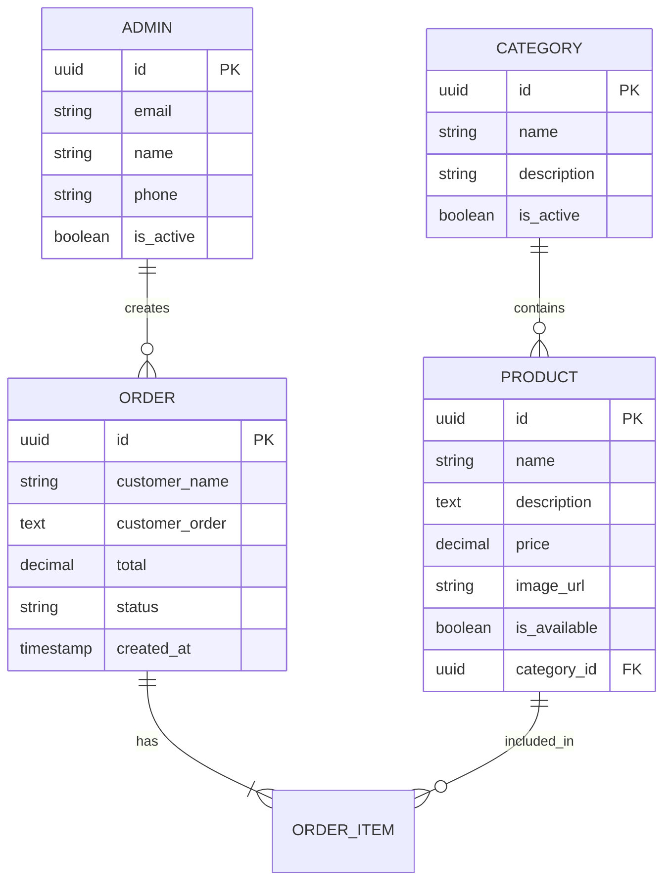

<h1 align="center">🍰 Dolce Vitta</h1>

<p align="center">
  <strong>Sistema de gerenciamento para confeitaria artesanal</strong>
</p>

<p align="center">
  <!-- Espaço reservado para GIF de demonstração -->
  
  <br>
</p>

<p align="center">
  
  
  
  
  
</p>

<p align="center">
  
  
  
</p>

<p align="center">
  <a href="https://dolce-vitta-xs.vercel.app">🌐 Ver Demo</a> •
  <a href="#-sobre-o-projeto">Sobre</a> •
  <a href="#-funcionalidades">Funcionalidades</a> •
  <a href="#-tecnologias">Tecnologias</a> •
  <a href="#-instalação">Instalação</a>
</p>

---

## 📋 Sobre o Projeto

**Dolce Vitta** é um sistema fullstack desenvolvido para gerenciamento de uma confeitaria artesanal. O sistema permite que administradores gerenciem produtos, categorias e pedidos, com uma interface moderna e responsiva.

### 🎯 Objetivo

Criar uma solução completa para pequenos empreendedores do ramo de confeitaria, facilitando:
- Gestão de catálogo de produtos
- Controle de pedidos
- Integração com WhatsApp para recebimento de encomendas

---

## ✨ Funcionalidades

### 👨‍💼 Área Administrativa
- ✅ Autenticação segura com Supabase Auth
- ✅ Dashboard com visão geral
- ✅ CRUD completo de produtos
- ✅ Gerenciamento de categorias
- ✅ Histórico de pedidos
- ✅ Perfil do administrador

### 🛍️ Catálogo (Em desenvolvimento)
- 🔄 Vitrine de produtos
- 🔄 Carrinho de compras
- 🔄 Finalização via WhatsApp

---

## 🛠️ Tecnologias

### Frontend
| Tecnologia | Descrição |
|------------|-----------|
| **React 18** | Biblioteca para construção de interfaces |
| **TypeScript** | Superset JavaScript com tipagem estática |
| **Vite** | Build tool moderna e rápida |
| **React Router** | Roteamento SPA |

### Backend
| Tecnologia | Descrição |
|------------|-----------|
| **Python 3.11** | Linguagem de programação |
| **FastAPI** | Framework web moderno e performático |
| **Serverless Functions** | Arquitetura serverless via Vercel |

### Infraestrutura
| Tecnologia | Descrição |
|------------|-----------|
| **Supabase** | Backend-as-a-Service (Auth + Database) |
| **PostgreSQL** | Banco de dados relacional |
| **Vercel** | Plataforma de deploy e hosting |

---

## 📁 Estrutura do Projeto

```
dolce-vitta/
├── 📂 api/                     # Backend (Serverless Functions)
│   ├── auth.py                # Autenticação (login, register, logout)
│   ├── users.py               # Gerenciamento de perfil
│   ├── products/              # CRUD de produtos
│   ├── categories/            # CRUD de categorias
│   ├── orders/                # Gerenciamento de pedidos
│   └── _utils/                # Utilitários (Supabase client, middleware)
│
├── 📂 src/                     # Frontend (React)
│   ├── components/            # Componentes reutilizáveis
│   ├── pages/                 # Páginas da aplicação
│   ├── services/              # Serviços (API, Supabase)
│   ├── contexts/              # Context API (Auth)
│   └── hooks/                 # Custom hooks
│
├── 📂 public/                  # Arquivos estáticos
├── 📂 supabase/                # Schema do banco de dados
├── 📄 vercel.json             # Configuração de deploy
└── 📄 requirements.txt        # Dependências Python
```

---

## 🚀 Instalação

### Pré-requisitos

- [Node.js](https://nodejs.org/) (v18+)
- [Python](https://python.org/) (v3.11+)
- [Git](https://git-scm.com/)
- Conta no [Supabase](https://supabase.com/)

### 1️⃣ Clone o repositório

```bash
git clone https://github.com/ojuansoares/dolse-vitta.git
cd dolse-vitta
```

### 2️⃣ Instale as dependências

```bash
# Frontend
npm install

# Backend
python -m venv .venv
.venv\Scripts\activate  # Windows
pip install -r requirements.txt
```

### 3️⃣ Configure as variáveis de ambiente

Crie um arquivo `.env` na raiz do projeto:

```env
# Frontend
VITE_SUPABASE_URL=sua_url_do_supabase
VITE_SUPABASE_ANON_KEY=sua_anon_key

# Backend
SUPABASE_URL=sua_url_do_supabase
SUPABASE_ANON_KEY=sua_anon_key
SUPABASE_SERVICE_ROLE_KEY=sua_service_role_key
```

### 4️⃣ Configure o banco de dados

Execute o script SQL em `supabase/schema.sql` no SQL Editor do Supabase.

### 5️⃣ Execute o projeto

```bash
# Terminal 1 - Backend
python -m api._server

# Terminal 2 - Frontend
npm run dev
```

Acesse: **http://localhost:5173**

---

## 🌐 Deploy

O projeto está configurado para deploy automático no **Vercel**:

1. Conecte o repositório ao Vercel
2. Configure as variáveis de ambiente no dashboard
3. Deploy automático a cada push na branch `main`

**🔗 Produção:** [https://dolce-vitta-xs.vercel.app](https://dolce-vitta-xs.vercel.app)

---

## 📊 Modelo de Dados



---

## 👨‍💻 Autor

<table>
  <tr>
    <td align="center">
      <a href="https://github.com/ojuansoares">
        <br>
        <sub><b>Juan Soares</b></sub>
      </a>
    </td>
  </tr>
</table>

---

## 📝 Licença

Este projeto está sob a licença MIT. Veja o arquivo [LICENSE](LICENSE) para mais detalhes.
